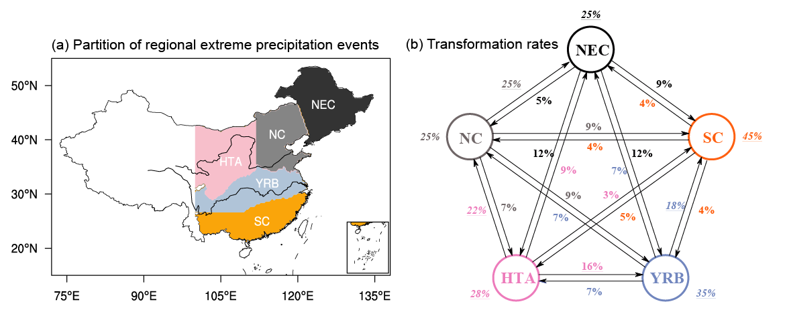

# Research interets

1. Monsoon simulation and evolution

2. Extreme precipitation

3. Air-sea interaction

---

## 1. Northward extension of East Asian monsoon climate in the geological history

<!--
  #默认位置

  
 #居中位置

 #图形靠左，右侧是文字
-->

  

• By integrating proxy records and climate simulations in the Eocene, Miocene, Pliocene and Present day, we find the seasonal march of East Asian summer monsoon emerged no later than the Miocene.

• The emergence of seasonal march was driven by Rossby wave responses from early summer to late summer, caused by the weakening of westerly jet colliding with the Tibetan Plateau.

• The emergence of seasonal march determined by the Tibetan Plateau uplift pushed the East Asian monsoon climate northward to the modern boundary.

## 2.Earlier seasonal march of East Asian summer monsoon in the mid-Pliocene

<!--

-->

  

• Based on CMIP6 simulations, the seasonal march of East Asian summer monsoon in the mid-Pliocene is about two weeks earlier than today.

• The earlier seasonal march is accompanied by a northward shift of monsoon rainfall and circulation in July, triggered by excessive convections over the western North Pacific through the PJ pattern-like teleconnection.

• The enhanced western North Pacific rainfall is resulted from low-level convergence, which acts as an atmospheric Kelvin wave response to the suppressed rainfall in tropics.

• The suppressed tropical rainfall is caused by a remote effect of greener vegetation and a local effect of closed seaways.

## 3. Multi-timescale changes in extreme precipitation over eastern China

  

• K-means clustering revealed five distinct types of extreme precipitation events developed over eastern China from 1961 to 2018.

• Five types of events have multi-timescale variations, and there are interconnections among them in synoptic and intraseasonal timescale.

# Projects

## 1. Evaluate the model performance of the present monsoon
Based on outputs from more than 80 climate models, we find (1) the dry bias of South Asian summer rainfall prevails in the coupled models from CMIP3 to CMIP6, related to local cold bias of sea surface temperature (He et al. 2022); (2) the large model uncertainty of dry bias mainly arises from sea surface temperature over the eastern Pacific and land surface temperature over western Asian (He et al. 2023, under review).

## 2. Understand the past monsoon in the geological history
Integrating paleoclimate model simulations, proxy records and physical diagnosis, we find (1) the northward extension of East Asia summer monsoon in the geological history is determined by the emergence of monsoon seasonal march (i.e., the stepwise northward rainfall stages) since the Miocene, driven by the uplift of Tibetan Plateau (He et al. 2023, under review); (2) the spring persistent rainfall in East Asia formed no later than the Miocene, while prior to that, the Eocene’s spring persistent rainfall only emerged in North America, which are orographically forced by the Tibetan Plateau uplift and North American continent shift (He et al. 2023, under review).

## 3. Explore the indication of past warm periods for the future monsoon
Based on model simulations and physical diagnoses, we find (1) the seasonal march of East Asian summer monsoon is earlier ~2 weeks in the mid-Pliocene, which is driven by the greener vegetation in the mid-latitudes and closed seaways in the tropics, while it shows a slight delay in the future (He et al. 2023, under review); (2) past warm periods could provide analogs for the future South Asian summer monsoon (in preparation).

## 4. Extreme precipitation
Based on objective clustering, we identify the changes in regional extreme precipitation events over eastern China subregions from intraseasonal timescale to long-term trends (He et al. 2021). Based on model simulations, optimal fingerprinting and physical diagnosis, we elucidate the anthropogenic impacts on the precipitation changes across all intensities over the Tibetan Plateau (He et al. 2023, under review). 
